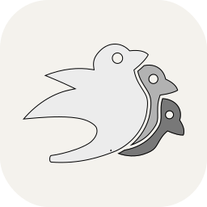
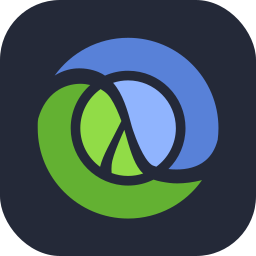
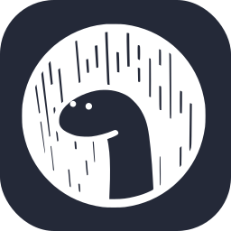
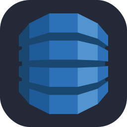
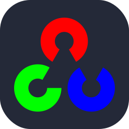
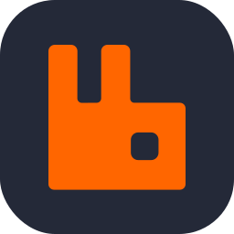
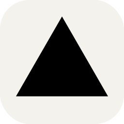
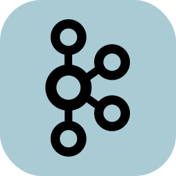

| Id               | Svg                                                                                                                                                                                    | Alias                                                | Themes     | Default theme |
| :--------------- | :------------------------------------------------------------------------------------------------------------------------------------------------------------------------------------- | :--------------------------------------------------- | :--------- | :------------ |
| ableton          | 

             | ableton,dark:ableton,light:ableton,test              | dark,light | dark          |
| activitypub      | 

     | activitypub,dark:activitypub,light:activitypub       | dark,light | dark          |
| actix            | 

                 | actix,dark:actix,light:actix                         | dark,light | dark          |
| aiscript         | 

           | aiscript,dark:aiscript,light:aiscript                | dark,light | dark          |
| alpinejs         | 

           | alpinejs,dark:alpinejs,light:alpinejs                | dark,light | dark          |
| anaconda         | 

           | anaconda,dark:anaconda,light:anaconda                | dark,light | dark          |
| androidstudio    | 

 | androidstudio,dark:androidstudio,light:androidstudio | dark,light | dark          |
| angular          | 

             | angular,dark:angular,light:angular                   | dark,light | dark          |
| apple            | 

                 | apple,dark:apple,light:apple                         | dark,light | dark          |
| arch             | 

                   | arch,dark:arch,light:arch                            | dark,light | dark          |
| autocad          | 

             | autocad,dark:autocad,light:autocad                   | dark,light | dark          |
| aws              | 

                     | aws,dark:aws,light:aws                               | dark,light | dark          |
| azure            | 

                 | azure,dark:azure,light:azure                         | dark,light | dark          |
| bash             | 

                   | bash,dark:bash,light:bash                            | dark,light | dark          |
| bevy             | 

                   | bevy,dark:bevy,light:bevy                            | dark,light | dark          |
| bitbucket        | 

         | bitbucket,dark:bitbucket,light:bitbucket             | dark,light | dark          |
| blender          | 

             | blender,dark:blender,light:blender                   | dark,light | dark          |
| bsd              | 

                     | bsd,dark:bsd,light:bsd                               | dark,light | dark          |
| bun              | 

                     | bun,dark:bun,light:bun                               | dark,light | dark          |
| cassandra        | 

         | cassandra,dark:cassandra,light:cassandra             | dark,light | dark          |
| clion            | 

                 | clion,dark:clion,light:clion                         | dark,light | dark          |
| clojure          | 

             | clojure,dark:clojure,light:clojure                   | dark,light | dark          |
| cloudflare       | 

       | cloudflare,dark:cloudflare,light:cloudflare          | dark,light | dark          |
| cmake            | 

                 | cmake,dark:cmake,light:cmake                         | dark,light | dark          |
| codepen          | 

             | codepen,dark:codepen,light:codepen                   | dark,light | dark          |
| coffeescript     | 

   | coffeescript,dark:coffeescript,light:coffeescript    | dark,light | dark          |
| crystal          | 

             | crystal,dark:crystal,light:crystal                   | dark,light | dark          |
| cypress          | 

             | cypress,dark:cypress,light:cypress                   | dark,light | dark          |
| d3               | 

                       | d3,dark:d3,light:d3                                  | dark,light | dark          |
| dart             | 

                   | dart,dark:dart,light:dart                            | dark,light | dark          |
| debian           | 

               | debian,dark:debian,light:debian                      | dark,light | dark          |
| deno             | 

                   | deno,dark:deno,light:deno                            | dark,light | dark          |
| devto            | 

                 | devto,dark:devto,light:devto                         | dark,light | dark          |
| discordjs        | 

         | discordjs,dark:discordjs,light:discordjs             | dark,light | dark          |
| dynamodb         | 

           | dynamodb,dark:dynamodb,light:dynamodb                | dark,light | dark          |
| eclipse          | 

             | eclipse,dark:eclipse,light:eclipse                   | dark,light | dark          |
| elasticsearch    | 

 | elasticsearch,dark:elasticsearch,light:elasticsearch | dark,light | dark          |
| elixir           | 

               | elixir,dark:elixir,light:elixir                      | dark,light | dark          |
| elysia           | 

               | elysia,dark:elysia,light:elysia                      | dark,light | dark          |
| emotion          | 

             | emotion,dark:emotion,light:emotion                   | dark,light | dark          |
| expressjs        | 

         | expressjs,dark:expressjs,light:expressjs             | dark,light | dark          |
| fediverse        | 

         | fediverse,dark:fediverse,light:fediverse             | dark,light | dark          |
| figma            | 

                 | figma,dark:figma,light:figma                         | dark,light | dark          |
| firebase         | 

           | firebase,dark:firebase,light:firebase                | dark,light | dark          |
| flask            | 

                 | flask,dark:flask,light:flask                         | dark,light | dark          |
| flutter          | 

             | flutter,dark:flutter,light:flutter                   | dark,light | dark          |
| gcp              | 

                     | gcp,dark:gcp,light:gcp                               | dark,light | dark          |
| gherkin          | 

             | gherkin,dark:gherkin,light:gherkin                   | dark,light | dark          |
| github           | 

               | github,dark:github,light:github                      | dark,light | dark          |
| githubactions    | 

 | githubactions,dark:githubactions,light:githubactions | dark,light | dark          |
| gitlab           | 

               | gitlab,dark:gitlab,light:gitlab                      | dark,light | dark          |
| gmail            | 

                 | gmail,dark:gmail,light:gmail                         | dark,light | dark          |
| godot            | 

                 | godot,dark:godot,light:godot                         | dark,light | dark          |
| gradle           | 

               | gradle,dark:gradle,light:gradle                      | dark,light | dark          |
| grafana          | 

             | grafana,dark:grafana,light:grafana                   | dark,light | dark          |
| graphql          | 

             | graphql,dark:graphql,light:graphql                   | dark,light | dark          |
| gtk              | 

                     | gtk,dark:gtk,light:gtk                               | dark,light | dark          |
| haskell          | 

             | haskell,dark:haskell,light:haskell                   | dark,light | dark          |
| haxe             | 

                   | haxe,dark:haxe,light:haxe                            | dark,light | dark          |
| haxeflixel       | 

       | haxeflixel,dark:haxeflixel,light:haxeflixel          | dark,light | dark          |
| hibernate        | 

         | hibernate,dark:hibernate,light:hibernate             | dark,light | dark          |
| htmx             | 

                   | htmx,dark:htmx,light:htmx                            | dark,light | dark          |
| hyperf           | 

               | hyperf,dark:hyperf,light:hyperf                      | dark,light | dark          |
| idea             | 

                   | idea,dark:idea,light:idea                            | dark,light | dark          |
| ipfs             | 

                   | ipfs,dark:ipfs,light:ipfs                            | dark,light | dark          |
| java             | 

                   | java,dark:java,light:java                            | dark,light | dark          |
| jenkins          | 

             | jenkins,dark:jenkins,light:jenkins                   | dark,light | dark          |
| julia            | 

                 | julia,dark:julia,light:julia                         | dark,light | dark          |
| kali             | 

                   | kali,dark:kali,light:kali                            | dark,light | dark          |
| kotlin           | 

               | kotlin,dark:kotlin,light:kotlin                      | dark,light | dark          |
| ktor             | 

                   | ktor,dark:ktor,light:ktor                            | dark,light | dark          |
| laravel          | 

             | laravel,dark:laravel,light:laravel                   | dark,light | dark          |
| latex            | 

                 | latex,dark:latex,light:latex                         | dark,light | dark          |
| less             | 

                   | less,dark:less,light:less                            | dark,light | dark          |
| linux            | 

                 | linux,dark:linux,light:linux                         | dark,light | dark          |
| lit              | 

                     | lit,dark:lit,light:lit                               | dark,light | dark          |
| lua              | 

                     | lua,dark:lua,light:lua                               | dark,light | dark          |
| markdown         | 

           | markdown,dark:markdown,light:markdown                | dark,light | dark          |
| mastodon         | 

           | mastodon,dark:mastodon,light:mastodon                | dark,light | dark          |
| materialui       | 

       | materialui,dark:materialui,light:materialui          | dark,light | dark          |
| matlab           | 

               | matlab,dark:matlab,light:matlab                      | dark,light | dark          |
| maven            | 

                 | maven,dark:maven,light:maven                         | dark,light | dark          |
| mint             | 

                   | mint,dark:mint,light:mint                            | dark,light | dark          |
| misskey          | 

             | misskey,dark:misskey,light:misskey                   | dark,light | dark          |
| mysql            | 

                 | mysql,dark:mysql,light:mysql                         | dark,light | dark          |
| neovim           | 

               | neovim,dark:neovim,light:neovim                      | dark,light | dark          |
| nestjs           | 

               | nestjs,dark:nestjs,light:nestjs                      | dark,light | dark          |
| netlify          | 

             | netlify,dark:netlify,light:netlify                   | dark,light | dark          |
| nextjs           | 

               | nextjs,dark:nextjs,light:nextjs                      | dark,light | dark          |
| nim              | 

                     | nim,dark:nim,light:nim                               | dark,light | dark          |
| nix              | 

                     | nix,dark:nix,light:nix                               | dark,light | dark          |
| nodejs           | 

               | nodejs,dark:nodejs,light:nodejs                      | dark,light | dark          |
| notion           | 

               | notion,dark:notion,light:notion                      | dark,light | dark          |
| npm              | 

                     | npm,dark:npm,light:npm                               | dark,light | dark          |
| nuxtjs           | 

               | nuxtjs,dark:nuxtjs,light:nuxtjs                      | dark,light | dark          |
| obsidian         | 

           | obsidian,dark:obsidian,light:obsidian                | dark,light | dark          |
| octave           | 

               | octave,dark:octave,light:octave                      | dark,light | dark          |
| opencv           | 

               | opencv,dark:opencv,light:opencv                      | dark,light | dark          |
| openstack        | 

         | openstack,dark:openstack,light:openstack             | dark,light | dark          |
| php              | 

                     | php,dark:php,light:php                               | dark,light | dark          |
| phpstorm         | 

           | phpstorm,dark:phpstorm,light:phpstorm                | dark,light | dark          |
| pinia            | 

                 | pinia,dark:pinia,light:pinia                         | dark,light | dark          |
| pkl              | 

                     | pkl,dark:pkl,light:pkl                               | dark,light | dark          |
| plan9            | 

                 | plan9,dark:plan9,light:plan9                         | dark,light | dark          |
| planetscale      | 

     | planetscale,dark:planetscale,light:planetscale       | dark,light | dark          |
| pnpm             | 

                   | pnpm,dark:pnpm,light:pnpm                            | dark,light | dark          |
| postgresql       | 

       | postgresql,dark:postgresql,light:postgresql          | dark,light | dark          |
| powershell       | 

       | powershell,dark:powershell,light:powershell          | dark,light | dark          |
| processing       | 

       | processing,dark:processing,light:processing          | dark,light | dark          |
| pug              | 

                     | pug,dark:pug,light:pug                               | dark,light | dark          |
| pycharm          | 

             | pycharm,dark:pycharm,light:pycharm                   | dark,light | dark          |
| python           | 

               | python,dark:python,light:python                      | dark,light | dark          |
| pytorch          | 

             | pytorch,dark:pytorch,light:pytorch                   | dark,light | dark          |
| qt               | 

                       | qt,dark:qt,light:qt                                  | dark,light | dark          |
| r                | 

                         | r,dark:r,light:r                                     | dark,light | dark          |
| rabbitmq         | 

           | rabbitmq,dark:rabbitmq,light:rabbitmq                | dark,light | dark          |
| raspberrypi      | 

     | raspberrypi,dark:raspberrypi,light:raspberrypi       | dark,light | dark          |
| react            | 

                 | react,dark:react,light:react                         | dark,light | dark          |
| reactivex        | 

         | reactivex,dark:reactivex,light:reactivex             | dark,light | dark          |
| redhat           | 

               | redhat,dark:redhat,light:redhat                      | dark,light | dark          |
| redis            | 

                 | redis,dark:redis,light:redis                         | dark,light | dark          |
| regex            | 

                 | regex,dark:regex,light:regex                         | dark,light | dark          |
| remix            | 

                 | remix,dark:remix,light:remix                         | dark,light | dark          |
| replit           | 

               | replit,dark:replit,light:replit                      | dark,light | dark          |
| rider            | 

                 | rider,dark:rider,light:rider                         | dark,light | dark          |
| rollupjs         | 

           | rollupjs,dark:rollupjs,light:rollupjs                | dark,light | dark          |
| ros              | 

                     | ros,dark:ros,light:ros                               | dark,light | dark          |
| scala            | 

                 | scala,dark:scala,light:scala                         | dark,light | dark          |
| scikitlearn      | 

     | scikitlearn,dark:scikitlearn,light:scikitlearn       | dark,light | dark          |
| sequelize        | 

         | sequelize,dark:sequelize,light:sequelize             | dark,light | dark          |
| sketchup         | 

           | sketchup,dark:sketchup,light:sketchup                | dark,light | dark          |
| solidjs          | 

             | solidjs,dark:solidjs,light:solidjs                   | dark,light | dark          |
| spring           | 

               | spring,dark:spring,light:spring                      | dark,light | dark          |
| stackoverflow    | 

 | stackoverflow,dark:stackoverflow,light:stackoverflow | dark,light | dark          |
| sublime          | 

             | sublime,dark:sublime,light:sublime                   | dark,light | dark          |
| supabase         | 

           | supabase,dark:supabase,light:supabase                | dark,light | dark          |
| svg              | 

                     | svg,dark:svg,light:svg                               | dark,light | dark          |
| symfony          | 

             | symfony,dark:symfony,light:symfony                   | dark,light | dark          |
| tailwindcss      | 

     | tailwindcss,dark:tailwindcss,light:tailwindcss       | dark,light | dark          |
| tauri            | 

                 | tauri,dark:tauri,light:tauri                         | dark,light | dark          |
| tensorflow       | 

       | tensorflow,dark:tensorflow,light:tensorflow          | dark,light | dark          |
| terraform        | 

         | terraform,dark:terraform,light:terraform             | dark,light | dark          |
| threejs          | 

             | threejs,dark:threejs,light:threejs                   | dark,light | dark          |
| ubuntu           | 

               | ubuntu,dark:ubuntu,light:ubuntu                      | dark,light | dark          |
| unity            | 

                 | unity,dark:unity,light:unity                         | dark,light | dark          |
| v                | 

                         | v,dark:v,light:v                                     | dark,light | dark          |
| vercel           | 

               | vercel,dark:vercel,light:vercel                      | dark,light | dark          |
| vim              | 

                     | vim,dark:vim,light:vim                               | dark,light | dark          |
| visualstudio     | 

   | visualstudio,dark:visualstudio,light:visualstudio    | dark,light | dark          |
| vite             | 

                   | vite,dark:vite,light:vite                            | dark,light | dark          |
| vitest           | 

               | vitest,dark:vitest,light:vitest                      | dark,light | dark          |
| vscode           | 

               | vscode,dark:vscode,light:vscode                      | dark,light | dark          |
| vscodium         | 

           | vscodium,dark:vscodium,light:vscodium                | dark,light | dark          |
| vuejs            | 

                 | vuejs,dark:vuejs,light:vuejs                         | dark,light | dark          |
| vuetify          | 

             | vuetify,dark:vuetify,light:vuetify                   | dark,light | dark          |
| webpack          | 

             | webpack,dark:webpack,light:webpack                   | dark,light | dark          |
| webstorm         | 

           | webstorm,dark:webstorm,light:webstorm                | dark,light | dark          |
| windicss         | 

           | windicss,dark:windicss,light:windicss                | dark,light | dark          |
| windows          | 

             | windows,dark:windows,light:windows                   | dark,light | dark          |
| workers          | 

             | workers,dark:workers,light:workers                   | dark,light | dark          |
| yarn             | 

                   | yarn,dark:yarn,light:yarn                            | dark,light | dark          |
| yew              | 

                     | yew,dark:yew,light:yew                               | dark,light | dark          |
| zig              | 

                     | zig,dark:zig,light:zig                               | dark,light | dark          |
| adonis           | 

                                                  | adonis,original:adonis                               | original   | original      |
| aftereffects     | 

                                            | aftereffects,original:aftereffects                   | original   | original      |
| ansible          | 

                                                 | ansible,original:ansible                             | original   | original      |
| apollo           | 

                                                  | apollo,original:apollo                               | original   | original      |
| appwrite         | 

                                                | appwrite,original:appwrite                           | original   | original      |
| arduino          | 

                                                 | arduino,original:arduino                             | original   | original      |
| astro            | 

                                                   | astro,original:astro                                 | original   | original      |
| atom             | 

                                                    | atom,original:atom                                   | original   | original      |
| audition         | 

                                                | audition,original:audition                           | original   | original      |
| azul             | 

                                                    | azul,original:azul                                   | original   | original      |
| babel            | 

                                                   | babel,original:babel                                 | original   | original      |
| bootstrap        | 

                                               | bootstrap,original:bootstrap                         | original   | original      |
| c                | 

                                                       | c,original:c                                         | original   | original      |
| cpp              | 

                                                     | cpp,original:cpp                                     | original   | original      |
| cs               | 

                                                      | cs,original:cs                                       | original   | original      |
| css              | 

                                                     | css,original:css                                     | original   | original      |
| discord          | 

                                                 | discord,original:discord                             | original   | original      |
| discordbots      | 

                                             | discordbots,original:discordbots                     | original   | original      |
| django           | 

                                                  | django,original:django                               | original   | original      |
| docker           | 

                                                  | docker,original:docker                               | original   | original      |
| dotnet           | 

                                                  | dotnet,original:dotnet                               | original   | original      |
| electron         | 

                                                | electron,original:electron                           | original   | original      |
| emacs            | 

                                                   | emacs,original:emacs                                 | original   | original      |
| ember            | 

                                                   | ember,original:ember                                 | original   | original      |
| fastapi          | 

                                                 | fastapi,original:fastapi                             | original   | original      |
| forth            | 

                                                   | forth,original:forth                                 | original   | original      |
| fortran          | 

                                                 | fortran,original:fortran                             | original   | original      |
| gamemakerstudio  | 

                                         | gamemakerstudio,original:gamemakerstudio             | original   | original      |
| gatsby           | 

                                                  | gatsby,original:gatsby                               | original   | original      |
| git              | 

                                                     | git,original:git                                     | original   | original      |
| golang           | 

                                                  | golang,original:golang,go                            | original   | original      |
| gulp             | 

                                                    | gulp,original:gulp                                   | original   | original      |
| heroku           | 

                                                  | heroku,original:heroku                               | original   | original      |
| html             | 

                                                    | html,original:html                                   | original   | original      |
| illustrator      | 

                                             | illustrator,original:illustrator                     | original   | original      |
| instagram        | 

                                               | instagram,original:instagram                         | original   | original      |
| javascript       | 

                                              | javascript,original:javascript,js                    | original   | original      |
| jest             | 

                                                    | jest,original:jest                                   | original   | original      |
| jquery           | 

                                                  | jquery,original:jquery                               | original   | original      |
| kafka            | 

                                                   | kafka,original:kafka                                 | original   | original      |
| kubernetes       | 

                                              | kubernetes,original:kubernetes                       | original   | original      |
| linkedin         | 

                                                | linkedin,original:linkedin                           | original   | original      |
| mongodb          | 

                                                 | mongodb,original:mongodb                             | original   | original      |
| nginx            | 

                                                   | nginx,original:nginx                                 | original   | original      |
| ocaml            | 

                                                   | ocaml,original:ocaml                                 | original   | original      |
| openshift        | 

                                               | openshift,original:openshift                         | original   | original      |
| p5js             | 

                                                    | p5js,original:p5js                                   | original   | original      |
| perl             | 

                                                    | perl,original:perl                                   | original   | original      |
| photoshop        | 

                                               | photoshop,original:photoshop                         | original   | original      |
| postman          | 

                                                 | postman,original:postman                             | original   | original      |
| premiere         | 

                                                | premiere,original:premiere                           | original   | original      |
| prisma           | 

                                                  | prisma,original:prisma                               | original   | original      |
| prometheus       | 

                                              | prometheus,original:prometheus                       | original   | original      |
| rails            | 

                                                   | rails,original:rails                                 | original   | original      |
| redux            | 

                                                   | redux,original:redux                                 | original   | original      |
| robloxstudio     | 

                                            | robloxstudio,original:robloxstudio                   | original   | original      |
| rocket           | 

                                                  | rocket,original:rocket                               | original   | original      |
| ruby             | 

                                                    | ruby,original:ruby                                   | original   | original      |
| rust             | 

                                                    | rust,original:rust                                   | original   | original      |
| sass             | 

                                                    | sass,original:sass                                   | original   | original      |
| selenium         | 

                                                | selenium,original:selenium                           | original   | original      |
| sentry           | 

                                                  | sentry,original:sentry                               | original   | original      |
| solidity         | 

                                                | solidity,original:solidity                           | original   | original      |
| sqlite           | 

                                                  | sqlite,original:sqlite                               | original   | original      |
| styledcomponents | 

                                        | styledcomponents,original:styledcomponents           | original   | original      |
| svelte           | 

                                                  | svelte,original:svelte                               | original   | original      |
| swift            | 

                                                   | swift,original:swift                                 | original   | original      |
| twitter          | 

                                                 | twitter,original:twitter                             | original   | original      |
| typescript       | 

                                              | typescript,original:typescript,ts                    | original   | original      |
| unrealengine     | 

                                            | unrealengine,original:unrealengine                   | original   | original      |
| vala             | 

                                                    | vala,original:vala                                   | original   | original      |
| webassembly      | 

                                             | webassembly,original:webassembly                     | original   | original      |
| webflow          | 

                                                 | webflow,original:webflow                             | original   | original      |
| wordpress        | 

                                               | wordpress,original:wordpress                         | original   | original      |
| xd               | 

                                                      | xd,original:xd                                       | original   | original      |
